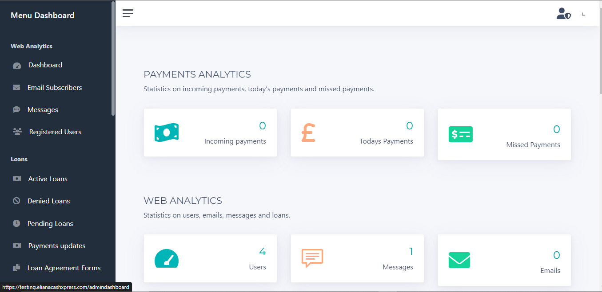
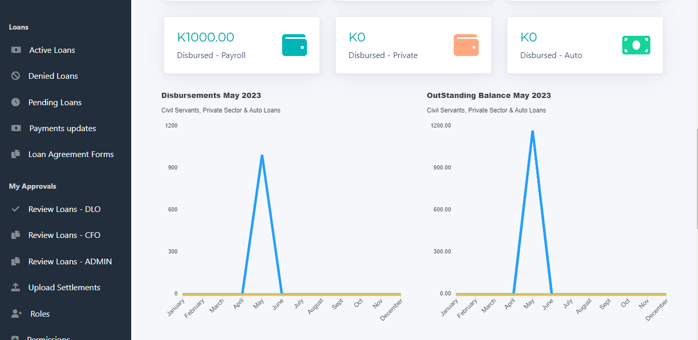

### Loan Management Software.

## Requirements

- PHP >= 8.0
- Laravel >= 8.0


## How it works

The Loan Management software is a web-based application that helps manage and track loans efficiently. It provides features to streamline the loan application process, automate loan approvals, and monitor loan repayments. This README file provides an overview of the software and instructions for installation, configuration, and usage.


## Features

1. User-friendly interface for managing loans, borrowers, and lenders. Contains two seperate dashboards. One for Admins and the other for borrowers.
2. Loan application form with customizable fields to collect borrowers information.
3. Automated loan approval process with customizable criteria and decision workflows.
4. Loan repayment tracking and reminders for borrowers.
5. Detailed loan reports and analytics for monitoring loan portfolios.
6. Role-based access control to manage user permissions.
7. Integration with external systems such as payment gateways and credit scoring services.
8. View Messages sent from the landing page from users.
9. View and Export Active Loans, Denied Loans and Pending Loans
10. Update Payments, Compile Loan Agreement Forms with Client Signatures and Upload Loan Settlement Forms
11. Assign roles, assign permissions, revoke roles Etc 

## Installation

### Clone the repository
Please follow carefully the installation and use of this web framework of the Loan Management System for better utilisation of it. Do not skip any stage.

```bash
git clone https://github.com/chandachewe10/loanmgtsystem.git
```

1. Am assuming by now you have already cloned the repo using this url `https://github.com/chandachewe10/loanmgtsystem.git`
2. Once cloned navigate to the root directory and open your CLI
3. on your CLI run `composer install --no-scripts`
4. run `copy .env.example .env`
5. run `php artisan config:clear`
6. run `php artisan cache:clear`
7. run `php artisan key:generate`
8. Now set up your database credentials in `.env` but do not migrate the tables yet
9. This system consists of a parent table `reg_employee_mst` which contains a foreign id which the childrens table will be referencing and as such it must be migrated first before other tables are run. Hence migrate it first as:
10.  
```bash
php artisan migrate --path=database/migrations/2022_01_31_191309_create_reg_employee_msts_table.php
```

11.  Now you can migrate other tables as usual:
12. `php artisan migrate`
13. `php artisan db:seed`
14. `php artisan serve --port=8080`
15.  This system uses email notifications to send some requests to clients in testing. You can set up that at mailtrap:
16. - [MALTRAP](https://mailtrap.io), Copy the mail credentials for Laravel app and put the codes in .`env`


## Credentials
```bash
1. superadmin
nrc: 123456/78/9
password: test1234

2. Chief Financil Officer (CFO)
nrc: 123456/18/9
password: test1234

3. Divisional Loan Officer (DLO)
nrc: 123456/12/1
password: test1234


```




## Contributions
Contributions to the Loan Management software are welcome! If you have suggestions, bug reports, or feature requests, please submit an issue or a pull request on the GitHub repository.

## License
The Loan Management software is open-source and released under the MIT License.

Feel free to customize this README file and the `welcome.blade.php` based on your specific Loan Management software and its features. Provide detailed instructions and include relevant information that would help users understand and use the software effectively.
